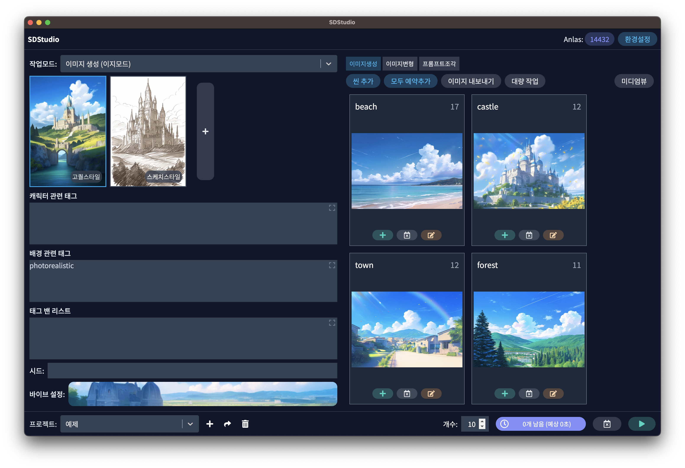
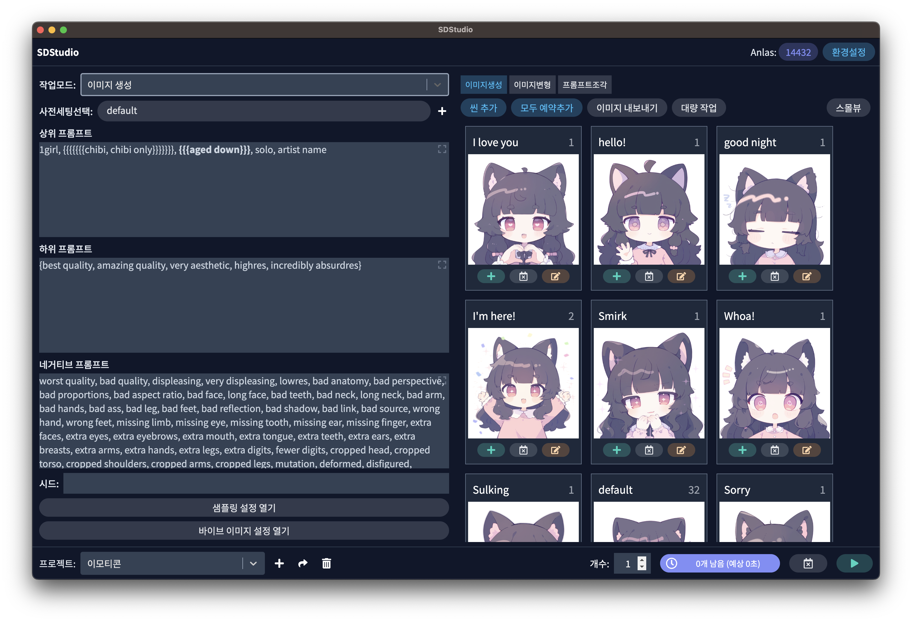
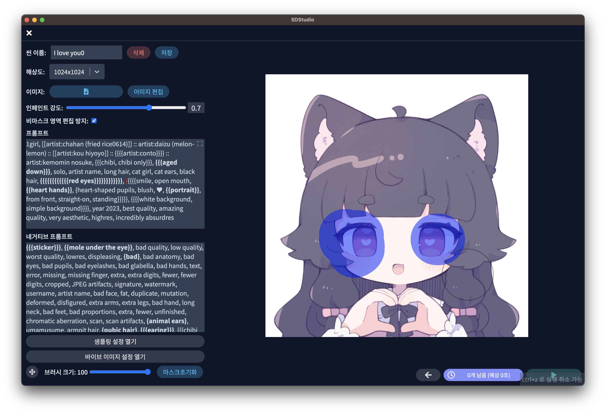
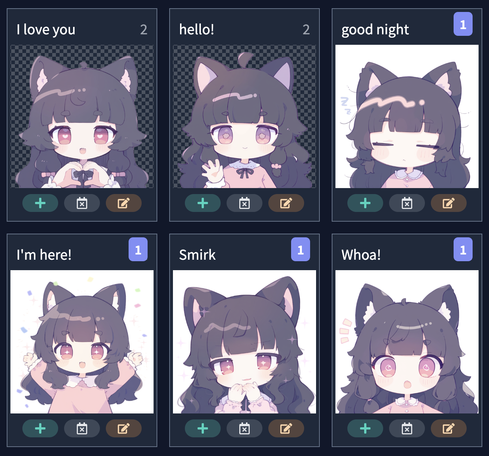
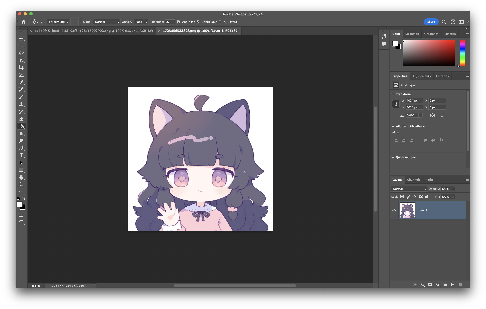
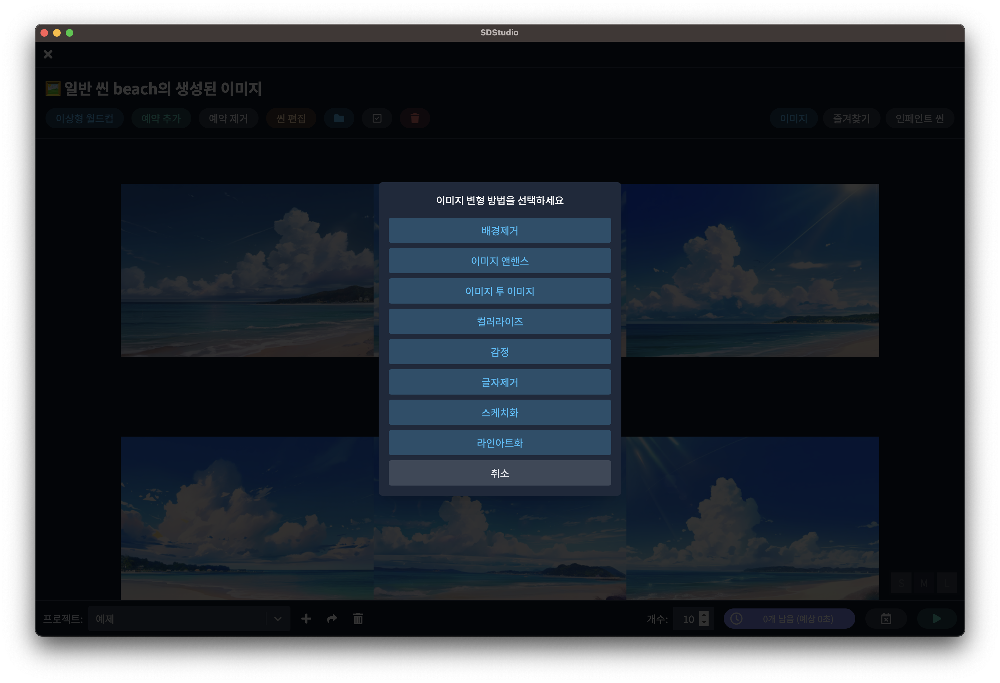
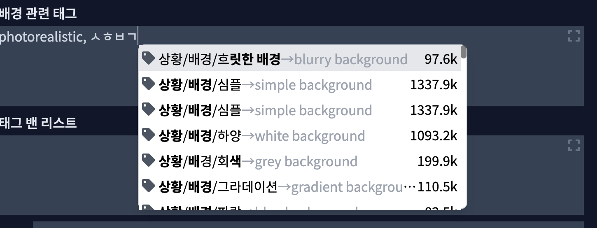
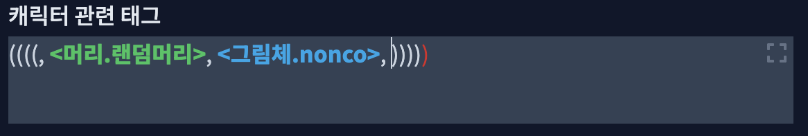
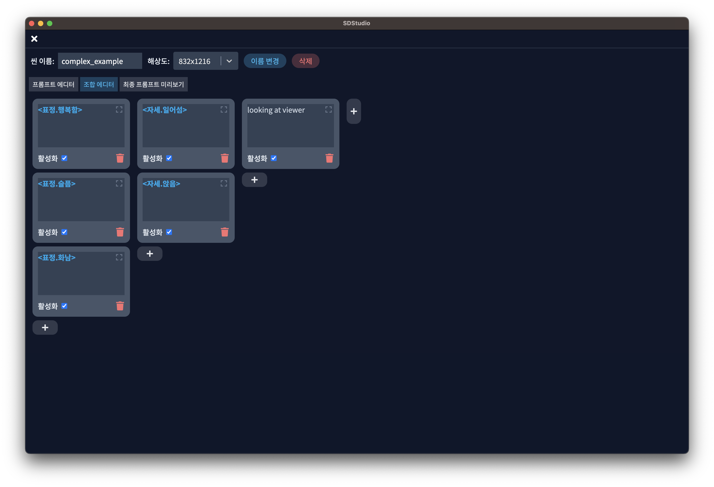

# 소개
Stable Diffusion 계열 API와 모델을 사용하기 편하게 해주는 프론트앤드 프로그램입니다. 모든 씬을 여러번 생성 예약을 해놓고 딴거하다가 와서 이미지를 이미지 월드컵으로 선택하고 리터칭하는 작업 흐름에 맞춰져 있습니다.




## 주요 기능

### 씬 별 이미지 생성


### 이미지 월드컵 기능


	
### 이미지 인페인팅 기능



### 자동 배경 제거 기능



### 포토샵 연동 기능



### 이미지 변형 기능



### 태그 자동 완성



###  프롬프트 조각 및 구문 하이라이팅 기능



### 프롬프트 조합 기능



## 직접 빌드하기

저장소를 받아 직접 빌드할 수 있습니다. 아래 순서는 GitHub Actions(`.github/workflows/build-win.yml`)가 깨끗한 체크아웃에서 쓰는 순서와 같고, Windows 에서 비밀 설정 파일 없이 처음부터 끝까지 빌드되는 것을 확인했습니다.

### 준비물

- **Node.js 22** (CI 기준. `package.json` 의 `engines` 는 22 이상 25 미만)
- **Git** — Windows 에서는 저장소 경로가 길면 일부 파일을 받지 못합니다(`Filename too long`). 짧은 경로(예: `C:\src\SDStudio`)에 받거나 `git clone -c core.longpaths=true …` 로 받으세요.
- **C++ 빌드 도구** — 네이티브 모듈(`src/native`)을 node-gyp 로 컴파일합니다. Windows 는 Visual Studio 2022 Build Tools(「C++를 사용한 데스크톱 개발」)와 Python 3 이 필요합니다. CI 는 node-gyp 가 아직 인식하지 못하는 VS 2026 을 피해 `windows-2022` 이미지를 씁니다.
- **Android 앱을 빌드할 때만**: Android Studio(동봉 JBR 사용), Android SDK Platform 34, Build-Tools 33 이상(서명용 `apksigner`·`zipalign`), NDK 25.1.8937393, CMake 3.22.1

### 설치와 PC 빌드

```bash
# 1) 네이티브 모듈과 내장 Capacitor 플러그인 준비
cd src/native && npm ci && cd ../..
cd externals/capacitor-background-mode && npm ci && npm run build && cd ../..

# 2) 의존성 설치(설치 스크립트는 건너뛰고) → 앱용 네이티브 의존성 설치·재빌드
npm ci --legacy-peer-deps --ignore-scripts
npx electron-builder install-app-deps

# 3) 검사·테스트·빌드·패키징
npm run typecheck
npm test
npm run build
npx electron-builder build --publish never --dir   # → release/build/win-unpacked/SDStudio.exe
```

주의: 저장소 루트에서 옵션 없이 `npm install`/`npm ci` 를 실행하면 의존성 peer 충돌(`ERESOLVE`)로 멈추고, 내장 플러그인(`externals/capacitor-background-mode`)도 빌드되지 않습니다. 위 순서대로 실행하세요.

개발 모드 실행은 `npm run build:dll` 을 한 번 실행한 뒤 `npm start` 입니다.

### Google 드라이브 연동 설정(선택)

`.env` 파일이 없어도 빌드는 성공합니다. 이때 Google 드라이브 연동은 환경설정에서 「설정 없음」으로 표시되고 연결할 수 없으며, 나머지 기능은 그대로 쓸 수 있습니다.

드라이브 연동을 쓰려면 **자신의 Google Cloud 프로젝트**가 필요합니다.

1. Google Cloud 콘솔에서 프로젝트를 만들고 **Google Drive API** 를 사용 설정합니다.
2. OAuth 동의 화면을 구성하고 범위 `https://www.googleapis.com/auth/drive.file` 을 추가합니다. 테스트 상태로 두면 인증이 7일마다 만료되므로 오래 쓰려면 게시(프로덕션)합니다.
3. PC: OAuth 클라이언트(유형 **데스크톱 앱**)를 만들고 `.env.example` 을 `.env` 로 복사해 클라이언트 ID·보안 비밀번호를 채운 뒤 `npm run build` 합니다. `.env` 는 커밋하지 마세요.
4. Android: 같은 프로젝트에 OAuth 클라이언트(유형 **Android**)를 만들고 앱의 패키지 이름과 **APK 서명 키의 SHA-1** 을 등록합니다(SHA-1 은 아래 `npm run apk:check` 가 보여 줍니다). 등록되지 않은 서명으로 연결하면 「이 빌드의 서명이 Google 프로젝트에 등록되어 있지 않습니다」 안내가 나옵니다.

`drive.file` 권한은 **Google Cloud 프로젝트 단위**입니다. 직접 빌드한 앱은 공식 배포판이 드라이브에 올린 백업을 볼 수 없고, 반대도 마찬가지입니다. 같은 백업을 PC 와 Android 에서 함께 쓰려면 두 클라이언트를 같은 프로젝트에 만드세요.

### Android 빌드와 서명

```bash
npm run build
npx cap sync android
cd android
# JAVA_HOME = Android Studio 의 jbr 폴더, Android SDK 위치 = ANDROID_HOME 환경 변수 또는 android/local.properties 의 sdk.dir
./gradlew assembleDebug     # 디버그 키로 서명된 시험용 APK
./gradlew assembleRelease   # 서명하지 않은 APK(app-release-unsigned.apk)
```

Android SDK 위치를 찾지 못하면 Gradle 이 `SDK location not found` 로 멈춥니다. Android Studio 로 `android` 폴더를 한 번 열면 `local.properties` 가 만들어집니다.

release APK 는 서명되지 않은 상태로 나오므로 `sign-apk.cjs` 로 서명합니다. 직접 빌드할 때는 **단일 키 모드**를 씁니다.

1. 자기 서명 키를 저장소 밖에 만듭니다(`keytool -genkeypair …`, 예시는 `android/keystore.properties.example`).
2. `android/keystore.properties.example` 을 `android/keystore.properties` 로 복사하고 `releaseStoreFile`·`releaseStorePassword` 만 채웁니다(`originalStoreFile` 줄이 없으면 단일 키 모드). 이 파일은 커밋하지 마세요.
3. 저장소 루트에서 `npm run apk:check` 로 모드·키·SHA-1 을 확인하고, `npm run apk:sign -- --out <저장할 APK 경로>` 로 서명·검증합니다.

키 회전 모드(`originalStoreFile` 포함)는 공식 배포 전용이며 공식 서명 키가 아니면 거부됩니다.

### 포크를 배포할 때

- **앱 ID 를 바꾸세요.** Android 는 `android/app/build.gradle` 의 `applicationId`(와 `capacitor.config.ts` 의 `appId`), PC 는 `package.json` 의 `build.appId` 입니다. Android 에서 공식 앱과 ID 가 같으면 서명이 달라 공식 설치본 위에 설치되지 않습니다(같은 ID 로는 두 앱을 함께 설치할 수 없습니다).
- **PC 데이터 폴더는 앱 이름으로 정해집니다.** 데이터는 Electron `userData`(Windows 는 `%APPDATA%\SDStudio`) 아래에 저장되며 이 경로는 앱 이름(`build.productName`, `release/app/package.json` 의 `name`)에서 나옵니다. 이름을 그대로 두면 공식 설치본과 같은 데이터 폴더를 함께 씁니다.
- **업데이트 알림.** 앱은 자동 업데이트(electron-updater)를 하지 않습니다. 대신 공식 저장소의 최신 GitHub 릴리스 번호를 확인해 새 버전 알림과 릴리스 페이지 링크를 보여 줍니다(`src/renderer/models/AppUpdateNoticeService.ts`, 링크는 `App.tsx`·`ConfigScreen.tsx`). 포크에서는 이 저장소 이름을 자기 저장소로 바꾸세요.

### 라이선스

MIT 라이선스입니다. 자세한 내용은 [LICENSE](LICENSE) 를 참고하세요.

## 크래딧

- 원작: [sunho/SDStudio](https://github.com/sunho/SDStudio)
- 이미지 씬 기능은 https://dendenai.xyz 의 프리셋 기능에서 파생되었습니다.
